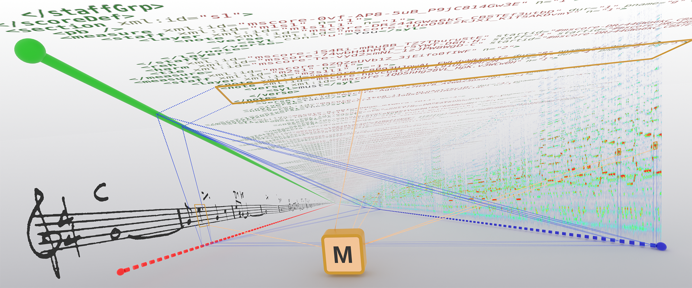

{width="100%" fig-alt="Lead figure of the TISMIR article: musical timelines across the physical, logical, and graphical domains, connected by conversion maps within timelines and match claims across them."}

# TimeToAlign! {.title}

<p class="subtitle lead">A Cross-Domain Timeline Model for Music Information Retrieval and Digital Musicology</p>

## What is TimeToAlign!?

Music research relies on heterogeneous time-related data: scores, recordings,
annotations, images, sensor data, and video. These artefacts differ in repertoire,
completeness, format, granularity, and quality control. Combining them requires
**alignment**---matching corresponding events across representations---which is
expensive, error-prone, and rarely reusable.

TimeToAlign! addresses this by providing:

1. A **generalised cross-domain model** for musical timelines and their
   alignments, grounded in three temporal domains (physical, logical, graphical)
   in both continuous and discrete variants.
2. A **working Python library** (`timetoalign`) implementing this model with
   typed timelines, loaders for common formats, conversion maps, and
   alignment primitives.

The model represents coordinate systems as nodes in a graph, connected by
s within a timeline and
 objects across timelines. This structure enables
coordinate transfer, annotation propagation, and alignment queries across
arbitrarily many representations of the same musical content.


## Documentation Structure

This documentation follows the
[Diataxis](https://diataxis.fr/) framework.

[**Tutorials**](tutorials.qmd)
:   Step-by-step notebooks that teach the `timetoalign` library from
    first principles, using real-world data.

    - [Quickstart](tutorials/tut00_quickstart.ipynb)
    - [Timelines and Coordinates](tutorials/tut01_timelines_and_coordinates.ipynb)
    - [Nesting and Timestamps](tutorials/tut02_nesting_and_timestamps.ipynb)
    - [Events on a Timeline](tutorials/tut03_events.ipynb)
    - [Loading Real Data](tutorials/tut04_loading_data.ipynb)
    - [Timeline Groups](tutorials/tut05_timeline_groups.ipynb)
    - [Alignment Bundles and MatchClaims](tutorials/tut06_alignment_bundles.ipynb)
    - [Flow Control and Grids](tutorials/tut07_flow_and_grids.ipynb)
    - [The Data Model](tutorials/tut08_data_model.ipynb)
    - [Pitch and Harmony across Formats](tutorials/tut09_pitch_and_harmony.ipynb)

[**How-To Guides**](howto.qmd)
:   Task-oriented recipes grouped by topic.

    *Timelines, Events & Maps* ---
    [How to Do Coordinate Math](howto/how01_coordinate_math.ipynb) ·
    [How to Use Advanced Conversion Maps](howto/how01_advanced_cmaps.ipynb) ·
    [How to Query Timestamps](howto/how01_advanced_timestamps.ipynb) ·
    [How to Construct Timelines Manually](howto/how01_manual_timeline_construction.ipynb) ·
    [How to Load Data](howto/how01_loading_data.ipynb) ·
    [How to Load Tabular Data](howto/how01_tabular_loaders.ipynb) ·
    [How to Work with Graphical Timelines](howto/how01_graphical_timelines.ipynb) ·
    [How to Transfer Annotations Between Graphical Analyses](howto/how01_thoresen_annotation_transfer.ipynb) ·
    [How to Build Beat Grids](howto/how01_beat_grids.ipynb)

    *TimelineGroups* ---
    [How to Align a Piano Roll (SUPRA)](howto/how02_supra_piano_roll.ipynb)

    *AlignmentBundles* ---
    [How to Create a Note Alignment](howto/how03_create_note_alignment.ipynb) ·
    [How to Align Multimodal Data (Beethoven)](howto/how03_beethoven_multimodal.ipynb) ·
    [How to Load the Vienna 4x22 Corpus](howto/how03_loading_vienna_corpus.ipynb) ·
    [How to Load an Audio-to-Score Alignment Corpus and Compare Performances](howto/how03_performance_precision.ipynb) ·
    [How to Load a parangonada Note Alignment Across Several Performances](howto/how03_parangonada.ipynb) ·
    [How to Load an MPM-Toolbox Project (Score, Modelled Performance, Observed Alignment)](howto/how03_mpm_toolbox.ipynb) ·
    [How to Load an Audio-to-Audio Alignment (Listen Here!)](howto/how03_listen_here.ipynb)

    *In-depth Topics* ---
    [How to Encode Song Genesis (Hendrix)](howto/how04_hendrix_song_genesis.ipynb) ·
    [How to Load CSV/TSV with column_specs and field_specs](howto/how04_loading_csv.ipynb)

[**Conceptual Model**](concepts.qmd)
:   The full specification of TimeToAlign!'s cross-domain timeline model:
    temporal domains, coordinates, events, flow control, conversion maps,
    nested timelines, alignment, and matching. This is the authoritative
    reference for the model's formal definitions and visual conventions.

[**Glossary**](glossary.qmd)
:   An alphabetical reference of all model terms, from AlignmentAnchor to
    WarpMap.

[**API Reference**](reference.qmd)
:   Auto-generated documentation for the `timetoalign` Python package.


## The Three Temporal Domains

At the heart of the model lies a simple observation: musical data can be
categorised into three temporal domains, each representing a different
modality through which music is experienced.

| Domain | Modality | Continuous | Discrete |
|--------|----------|------------|----------|
| **Physical** | Hearing | seconds | samples |
| **Logical** | Conceptualising | quarter notes, beats | ticks, divisions |
| **Graphical** | Seeing | metres, points | pixels |

: The six timeline types arising from three domains and two number types. {#tbl-domains}

A score, for instance, is *both* graphical and logical---it is itself an
alignment between pixel coordinates and musical time. A performance is
physical (audio samples or seconds) but encodes the logical structure of
the score. Bridging these domains in a principled, reusable manner is what
TimeToAlign! is for.

For the full specification, see the [Conceptual Model](concepts.qmd).


## Getting Started

The `timetoalign` library is available on PyPI. To install it:

```bash
pip install timetoalign
```

The library requires Python 3.11 or later.


## Project Links

- **Source Code**: [GitHub](https://github.com/timetoalign/timetoalign)
- **Notebooks**: [[README]](https://github.com/TimeToAlign/timetoalign/tree/main/docs)
- **Specimen Collection**: Forthcoming. Watch this space!
- **TISMIR Article**: [Time to Align! Modelling Musical Timelines for Music
  Information Retrieval and Digital Musicology](https://doi.org/10.5334/tismir.296)

::: {.callout-note title="How to cite"}
Please cite the published TISMIR article:

    Hentschel, Johannes; Berndt, Axel; Cancino-Chacón, Carlos; Dixon, Simon; Foo, Anne; Gotham, Mark; Hu, Patricia; Köster, Maik; Martins, Felipe D.; Mauro, Davide A.; Müller, Meinard; Neuwirth, Markus; Pacha, Alexander; Page, Kevin R.; Peter, Silvan; Polyakov, Egor; Pugin, Laurent; Weigl, David M.; Weiß, Christof; and Widmer, Gerhard. 2026. "Time to Align! Modelling Musical Timelines for Music Information Retrieval and Digital Musicology." *Transactions of the International Society for Music Information Retrieval* 9 (1): 384--404. https://doi.org/10.5334/tismir.296.

A BibTeX entry ships in the repository via the [README Citing section](https://github.com/TimeToAlign/timetoalign/tree/main#citing) and `CITATION.cff`.
:::
